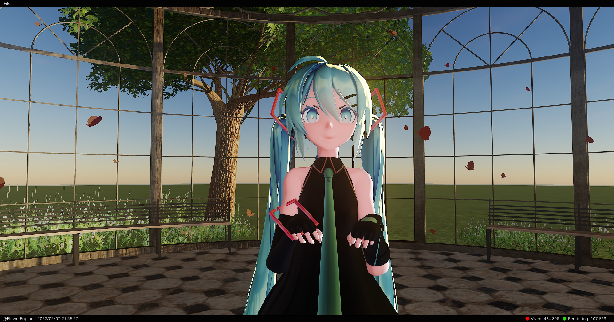
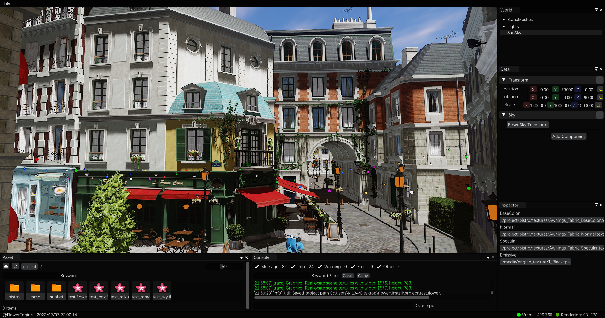

NOTE: The repo code is old but still can work, current project is under refactoring, i will update repo when my job done.

you can also watch the video on youtube or bilibili:

https://www.youtube.com/watch?v=ciw8UOmaFaI

https://www.bilibili.com/video/BV1FL4y147DN?share_source=copy_web

2022/02/07 20:44 Dev Snapshot

# Vulkan Engine Develop Test.

## Current Developing Feature

- Gpu Driven Rendering Pipeline.
- Bindless Material System.
- PBS Shading System.
- Gpu Dispatch Sample Distribution Shadow Maps.
- Fast Downsample Guassian Blur Bloom.
- TAA.
- FXAA.
- Light Shaft.
- Precompute Atmosphere.
- SSSS Skin.
